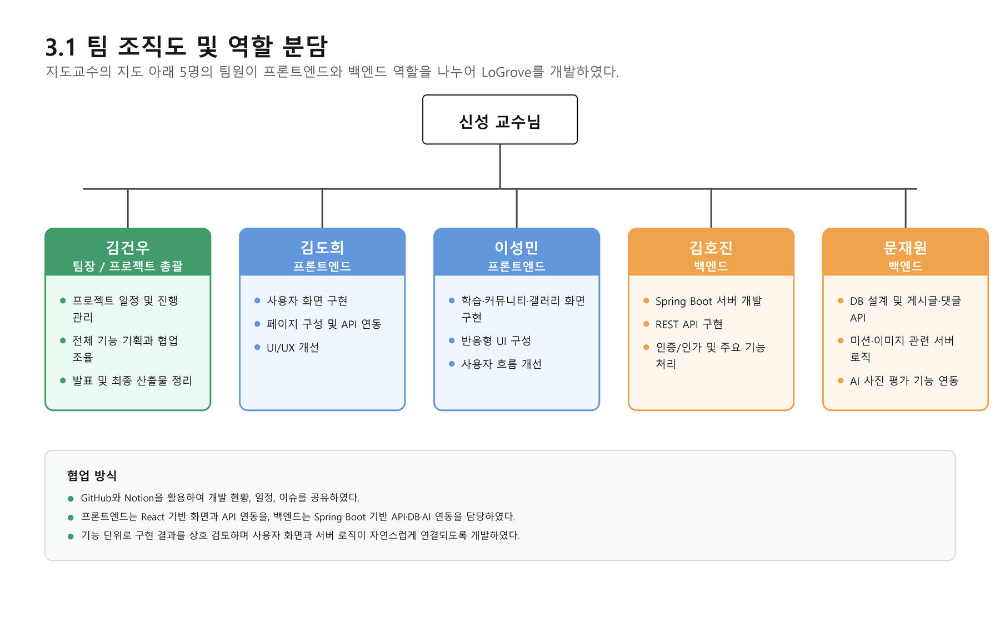

# LoGrove

<p align="center">
  
</p>

<p align="center">
  <strong>AI 기반 사진 학습 커뮤니티 플랫폼</strong><br />
  사진을 배우고, 공유하고, AI 피드백으로 성장하는 초보자 친화형 사진 커뮤니티
</p>

<p align="center">
  <a href="https://github.com/LoGrove/LoGrove">Project Hub</a>
  ·
  <a href="https://github.com/kgw2611/LoGrove-web">Web</a>
  ·
  <a href="https://github.com/kgw2611/LoGrove-server">Server</a>
  ·
  <a href="https://github.com/eve-ho/logroveTagger">AI Tagger</a>
</p>

<br />

## About

LoGrove는 사진 입문자가 흩어진 정보 속에서 길을 잃지 않고, 학습과 커뮤니티 활동을 함께 이어갈 수 있도록 만든 웹 기반 사진 플랫폼입니다.

사용자는 커뮤니티와 갤러리에서 사진과 정보를 공유하고, 단계별 미션으로 사진 이론과 구도를 학습하며, 직접 촬영한 사진에 대해 AI 평가와 태그 추천을 받을 수 있습니다.

## Key Features

### 사진 중심 커뮤니티

커뮤니티, 갤러리, 포럼 게시판을 분리해 자유 소통, 사진 공유, 장비/브랜드 정보 교류를 목적에 맞게 사용할 수 있습니다. 갤러리는 카드형 UI와 태그 필터를 제공해 원하는 주제의 사진을 빠르게 탐색할 수 있습니다.


### AI 자동 태깅

갤러리 작성 시 이미지를 업로드하면 [logroveTagger](https://github.com/eve-ho/logroveTagger)가 OpenAI CLIP `ViT-B/32` 모델로 이미지를 분석해 추천 태그를 반환합니다. 태그는 피사체, 구도, 촬영법, 색감, 시간, 기타 카테고리 기준으로 정렬되며 검색과 필터링에 활용됩니다.


### 단계별 사진 미션

사진 이론, 구도, 카메라 조작법 등 주제별 학습 미션을 제공합니다. 사용자는 이전 단계를 완료해야 다음 단계로 이동할 수 있어 자연스럽게 학습 흐름을 따라갈 수 있습니다.


### AI 사진 평가

사진 제출형 미션에서는 사용자가 주제에 맞는 사진을 제출하면 Gemini API가 이미지를 평가하고 점수와 피드백을 제공합니다. 단순 퀴즈가 아니라 직접 촬영한 결과물로 학습할 수 있도록 구성했습니다.


### 개인 활동 관리

마이페이지에서 프로필, 레벨, 경험치, 작성 글, 댓글, 갤러리 사진, 미션 제출 사진을 한 번에 확인할 수 있습니다.


## Architecture

LoGrove는 프론트엔드, 백엔드, AI 태깅 서버, 데이터베이스, 외부 AI API를 분리해 구성했습니다. React 웹 클라이언트가 사용자 화면을 담당하고, Spring Boot 서버가 인증, 게시글, 댓글, 이미지 저장, 미션 처리를 수행합니다.

자동 태깅은 FastAPI 기반 `logroveTagger` 서버가 맡고, 사진 미션 평가는 백엔드에서 Gemini API를 호출해 처리합니다.


## Tech Stack

### Frontend

<p>
  
  
  
  
  
  
</p>

### Backend

<p>
  
  
  
  
  
  
  
</p>

### AI Tagging / Evaluation

<p>
  
  
  
  
  
</p>

### Infra

<p>
  
  
  
</p>

## Repositories

- [LoGrove-web](https://github.com/kgw2611/LoGrove-web): React 기반 웹 클라이언트
- [LoGrove-server](https://github.com/kgw2611/LoGrove-server): Spring Boot 기반 백엔드 서버
- [logroveTagger](https://github.com/eve-ho/logroveTagger): FastAPI + CLIP 기반 자동 태깅 서버

## Project Structure

```text
LoGrove
├─ README.md
└─ readme_assets

LoGrove-web
└─ src
   ├─ app
   ├─ features
   ├─ pages
   ├─ shared
   └─ widgets

LoGrove-server
└─ src/main/java/com/hansung/logrove
   ├─ auth
   ├─ comment
   ├─ gemini
   ├─ mission
   ├─ post
   ├─ storage
   ├─ tag
   └─ user
```

## Run Locally

### Backend

```bash
cd LoGrove-server
./gradlew bootRun
```

로컬 실행 시 `application-secret.yaml`에 DB 비밀번호, JWT secret, Gemini API key 등 민감 정보를 별도로 설정해야 합니다.

### Frontend

```bash
cd LoGrove-web
npm install
npm run dev
```

### AI Tagger

```bash
cd logroveTagger
pip install torch torchvision clip pillow fastapi uvicorn python-multipart
python main.py
```

자동 태깅 서버의 Swagger UI는 `http://localhost:8000/docs`에서 확인할 수 있습니다.

## Team

- **김건우**: 팀장, 프론트엔드, 갤러리/글쓰기, 웹 및 API 통합
- **김도희**: 프론트엔드, 사용자 화면, 페이지 구성, UI/UX 개선
- **이성민**: 프론트엔드, 학습/커뮤니티 화면, 사용자 흐름 개선
- **김호진**: 백엔드, Spring Boot API, REST API, 인증/인가
- **문재원**: 백엔드, DB 설계, 미션/이미지 서버 로직, AI 사진 평가 연동



## References

- [LoGrove Project Hub](https://github.com/LoGrove/LoGrove)
- [logroveTagger](https://github.com/eve-ho/logroveTagger)
- [The Role of Gamification in Enhancing User Engagement on Social Media](https://www.dbpia.co.kr/journal/articleDetail?nodeId=NODE12031187)
