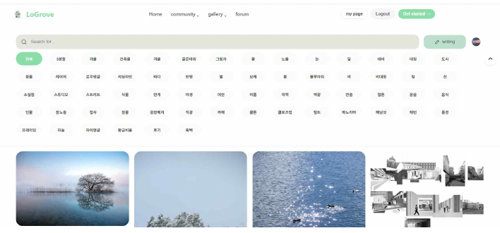
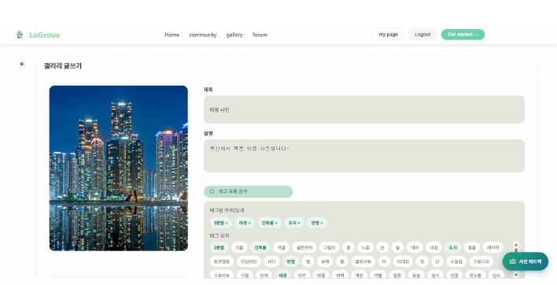
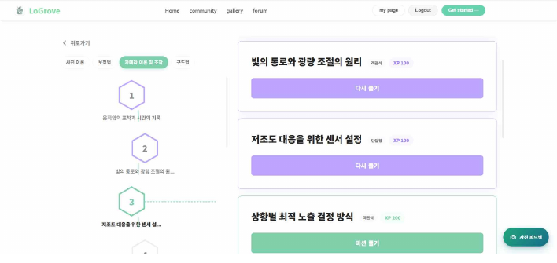
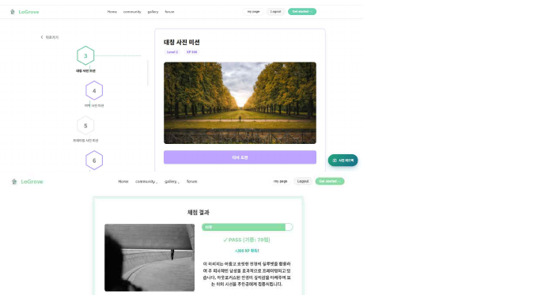
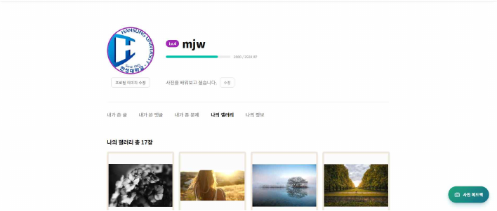
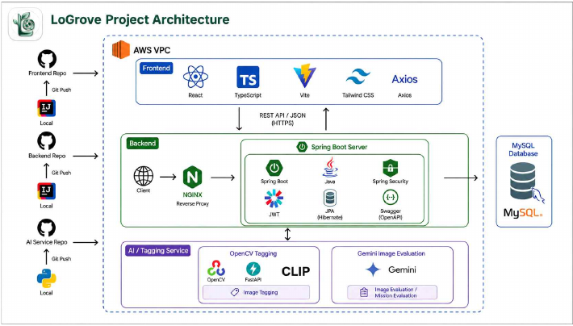
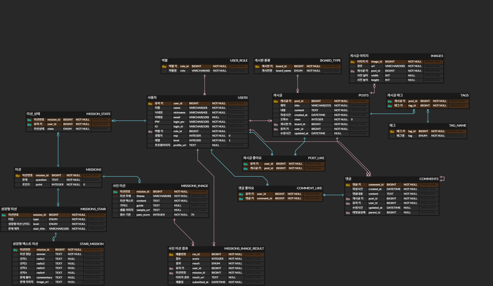

# LoGrove

<p align="center">
  
</p>

<p align="center">
  <strong>사진 입문자를 위한 AI 기반 사진 커뮤니티 플랫폼</strong><br />
  커뮤니티, 갤러리, 포럼, 단계별 미션, AI 사진 평가를 한 곳에서 제공합니다.
</p>

<p align="center">
  <a href="https://github.com/kgw2611/LoGrove-web/releases/tag/v0.9">Web Release</a>
  ·
  <a href="https://github.com/kgw2611/LoGrove-server/releases/tag/v0.9">Server Release</a>
</p>

<br />

## 프로젝트 소개

LoGrove는 사진 취미에 특화된 웹 기반 커뮤니티 서비스입니다. 사진에 처음 입문하는 사용자도 구도, 카메라 조작, 촬영 주제 등을 단계별 미션으로 학습하고, 직접 촬영한 사진을 업로드해 AI 기반 평가와 피드백을 받을 수 있습니다.

일반 커뮤니티 기능에 더해 갤러리, 카메라 브랜드별 포럼, CLIP/Gemini 기반 태그 추천과 사진 평가를 결합하여 사진을 배우고 공유하는 과정을 하나의 서비스 흐름으로 연결했습니다.

| 항목 | 내용 |
| --- | --- |
| 프로젝트명 | LoGrove |
| 핵심 키워드 | 사진 커뮤니티, AI 태깅, Gemini 평가, 미션 학습, 게이미피케이션 |

## 기획 배경

사진 취미는 고가의 장비, 복잡한 전문 용어, 분산된 정보 때문에 초보자가 쉽게 시작하기 어렵습니다. LoGrove는 사진 입문자가 필요한 정보를 빠르게 찾고, 커뮤니티 활동과 미션 학습을 통해 자연스럽게 성장할 수 있는 통합 플랫폼을 목표로 합니다.

## 주요 기능

### 커뮤니티 / 갤러리 / 포럼

사용자는 목적에 따라 커뮤니티, 갤러리, 포럼 게시판을 이용할 수 있습니다. 게시글 작성, 목록 조회, 상세 조회, 댓글, 좋아요 기능을 제공하며, 갤러리는 사진 감상에 적합한 카드형 UI와 태그 필터를 지원합니다.



### 갤러리 작성 및 AI 태그 추천

갤러리 작성 화면에서는 사진, 제목, 설명을 입력하고 태그를 직접 선택할 수 있습니다. 이미지 분석 서버와 AI API를 통해 사진의 특징에 맞는 태그를 추천받아 검색과 필터링에 활용할 수 있습니다.



### 단계별 사진 학습 미션

사진 이론, 구도, 카메라 조작법 등 주제별 미션을 난이도 단계에 따라 제공합니다. 이전 문제를 해결해야 다음 단계로 이동할 수 있어 학습 흐름을 유지할 수 있습니다.



### AI 기반 사진 제출형 미션

사용자가 주제에 맞는 사진을 제출하면 Gemini API가 이미지를 분석하고 점수와 피드백을 제공합니다. 3분할, 중앙 배치, 피사체 표현 등 사진 촬영 요소를 직접 실습하며 학습할 수 있습니다.



### 마이페이지 및 개인 갤러리

마이페이지에서는 프로필, 닉네임, 레벨, 경험치, 소개글을 관리할 수 있습니다. 사용자가 작성한 글과 댓글, 갤러리 사진, 미션 제출 사진을 한 곳에서 확인할 수 있습니다.



## 시스템 아키텍처

LoGrove는 프론트엔드, 백엔드, AI 태깅 서버, 데이터베이스, 외부 Gemini API를 역할별로 분리했습니다. 프론트엔드는 React 기반 웹 화면을 담당하고, Spring Boot 백엔드는 인증, 게시글, 이미지 저장, 미션 처리 등 주요 비즈니스 로직을 수행합니다. 이미지 태깅은 FastAPI 기반 AI 서버에서 OpenCV와 CLIP으로 처리하며, 사진 평가 미션은 Gemini API를 호출해 결과를 제공합니다.



## ERD

사용자, 게시글, 댓글, 태그, 이미지, 미션, 미션 상태, 사진 미션 결과를 중심으로 데이터 모델을 구성했습니다.



## 기술 스택

### Frontend

| 분류 | 기술 |
| --- | --- |
| Core | React, TypeScript, Vite |
| Routing / API | React Router, Axios |
| Editor / Content | TipTap, sanitize-html |
| Image / UI | React Photo Album, CSS |
| App Runtime | Capacitor |

### Backend

| 분류 | 기술 |
| --- | --- |
| Core | Java 21, Spring Boot |
| Web / Data | Spring Web, Spring Data JPA, Hibernate |
| Security | Spring Security, JWT |
| Database | MySQL |
| API Docs | Springdoc OpenAPI / Swagger |
| Image | Thumbnailator, WebP ImageIO |
| AI 연동 | Gemini API, CLIP 태깅 서버 연동 |

### Infra / DevOps

| 분류 | 기술 |
| --- | --- |
| Deploy | AWS EC2, Nginx |
| Automation | GitHub Actions |
| Architecture | FE / BE / AI Service / DB 분리 |

## 프로젝트 구조

```text
LoGrove
├─ README.md
└─ readme_assets

LoGrove-web
├─ public
└─ src
   ├─ app
   ├─ assets
   ├─ features
   ├─ pages
   │  ├─ auth
   │  ├─ home
   │  ├─ mission
   │  ├─ post
   │  └─ user
   ├─ shared
   └─ widgets

LoGrove-server
└─ src/main/java/com/hansung/logrove
   ├─ auth
   ├─ comment
   ├─ gemini
   ├─ global
   ├─ mission
   ├─ post
   ├─ storage
   ├─ tag
   └─ user
```


프론트엔드는 Vite 개발 서버로 실행되며, API 요청은 Spring Boot 백엔드 서버와 연동됩니다.

## API 문서

백엔드 실행 후 Swagger UI에서 API 명세를 확인할 수 있습니다.

```text
http://localhost:8080/swagger-ui/index.html
```

## 팀원

| 이름 | 주요 담당 |
| --- | --- |
| 김건우 | 팀장, 백엔드/프론트엔드/DB 설계, 웹 및 API 통합, 클라우드 배포 |
| 김도희 | 프론트엔드, 페이지 구성, FE 화면 개발, UI/UX 디자인 |
| 이성민 | 프론트엔드, FE 화면 개발, UI/UX 개선 |
| 김호진 | 백엔드, Python Fast API, Python 이미지 분석 로직 |
| 문재원 | 백엔드, DB 설계, 서버 로직 및 api 개발, AI api 연동 |


## 참고 자료

- [LoGrove Web v0.9](https://github.com/kgw2611/LoGrove-web/releases/tag/v0.9)
- [LoGrove Server v0.9](https://github.com/kgw2611/LoGrove-server/releases/tag/v0.9)
- [The Role of Gamification in Enhancing User Engagement on Social Media](https://www.dbpia.co.kr/journal/articleDetail?nodeId=NODE12031187)
